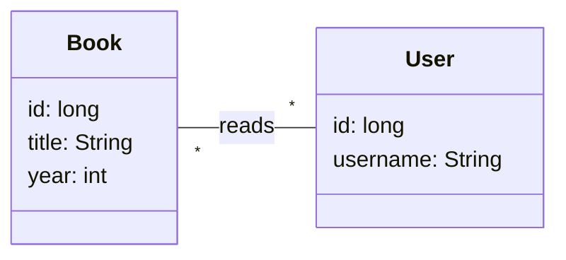

# micronaut-solutions

Model solutions for the Micronaut labs: book microservice.

## Bounded context

This microservice manages a small book database, where `Book`s are written by `Author`s and read by `User`s.



## Developing the microservice

To develop the microservice, first start the Compose project in this directory:

```sh
docker compose up -d
```

Visit the local instance of [kafka-ui](http://localhost:9000), and create the `book-read` topic.

You can then develop the microservice using any Gradle-compatible IDE, like Eclipse or VS Code.

To launch the microservice from the source code, run:

```sh
cd book-microservice
./gradlew run
```

## Developing the CLI client

The command-line client will run its tests against a local instance of the microservice, listening from port 8080.

You will need to start the microservice yourself, and then run the CLI client build:

```sh
cd book-cli
./gradlew build
```